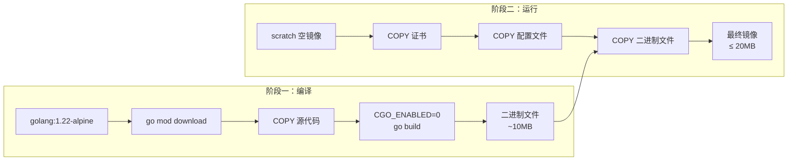

# Docker 部署指南

## 概念说明

GoBlog 使用 Docker 多阶段构建生成极小的生产镜像（≤ 20MB），并通过 Docker Compose 实现一键启动。

## 核心原理

### 多阶段构建



### 关键配置说明

| 配置项 | 说明 |
|--------|------|
| `CGO_ENABLED=0` | 禁用 CGO，生成纯静态链接二进制 |
| `-ldflags="-s -w"` | 去除调试信息和符号表，减小体积 |
| `-trimpath` | 去除编译路径信息，提高安全性 |
| `scratch` 基础镜像 | 零依赖空镜像，最小攻击面 |

## Dockerfile

```dockerfile
# 阶段一：编译
FROM golang:1.22-alpine AS builder
RUN apk add --no-cache ca-certificates tzdata
WORKDIR /build
COPY go.mod go.sum ./
RUN go mod download
COPY . .
RUN CGO_ENABLED=0 GOOS=linux GOARCH=amd64 go build \
    -ldflags="-s -w" -trimpath \
    -o goblog ./cmd/goblog/

# 阶段二：运行
FROM scratch
COPY --from=builder /etc/ssl/certs/ca-certificates.crt /etc/ssl/certs/
COPY --from=builder /usr/share/zoneinfo /usr/share/zoneinfo
COPY --from=builder /build/configs/config.yaml /configs/config.yaml
COPY --from=builder /build/migrations /migrations
COPY --from=builder /build/goblog /goblog
ENV TZ=Asia/Shanghai
EXPOSE 8080
ENTRYPOINT ["/goblog"]
```

## Docker Compose

```yaml
services:
  postgres:
    image: postgres:16-alpine
    environment:
      POSTGRES_USER: postgres
      POSTGRES_PASSWORD: postgres123
      POSTGRES_DB: goblog
    healthcheck:
      test: ["CMD-SHELL", "pg_isready -U postgres"]

  redis:
    image: redis:7-alpine
    healthcheck:
      test: ["CMD", "redis-cli", "ping"]

  goblog:
    build: .
    ports:
      - "8080:8080"
    environment:
      GOBLOG_DATABASE_HOST: postgres
      GOBLOG_REDIS_ADDR: redis:6379
    depends_on:
      postgres:
        condition: service_healthy
      redis:
        condition: service_healthy
```

## 部署命令

```bash
# 一键构建并启动
docker compose up -d --build

# 查看日志
docker compose logs -f goblog

# 停止服务
docker compose down

# 清理数据卷
docker compose down -v

# 单独构建镜像
docker build -t goblog .

# 查看镜像大小
docker images goblog
```

## 生产环境建议

1. **修改 JWT Secret**：使用强随机字符串
2. **修改数据库密码**：使用 Docker Secrets 或环境变量
3. **启用 HTTPS**：在前端使用 Nginx 反向代理
4. **配置日志持久化**：挂载日志目录到宿主机
5. **设置资源限制**：在 Docker Compose 中配置 `deploy.resources`

## 代码示例

> 💻 完整可运行代码：
> - [code-examples/06-fullstack-project/goblog/Dockerfile](https://github.com/)
> - [code-examples/06-fullstack-project/goblog/docker-compose.yml](https://github.com/)

## 常见面试题

### Q1: Docker 多阶段构建的优势？

**难度**：⭐⭐ | **频率**：🔥🔥🔥

**答题思路**：减小镜像体积（只包含运行时需要的文件）、提高安全性（不包含编译工具链）、加速部署。

### Q2: 为什么 Go 应用适合使用 scratch 镜像？

**难度**：⭐⭐ | **频率**：🔥🔥

**答题思路**：Go 编译为静态链接的单一二进制文件（CGO_ENABLED=0），不依赖系统库，可以在空镜像上运行。

## 参考资料

- [Docker 多阶段构建](https://docs.docker.com/build/building/multi-stage/)
- [Docker Compose 文档](https://docs.docker.com/compose/)
