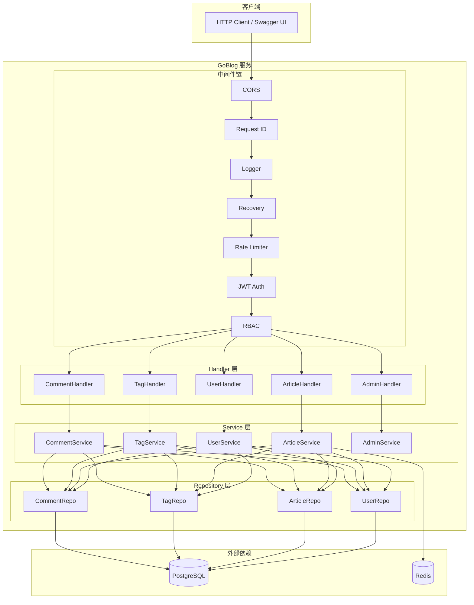
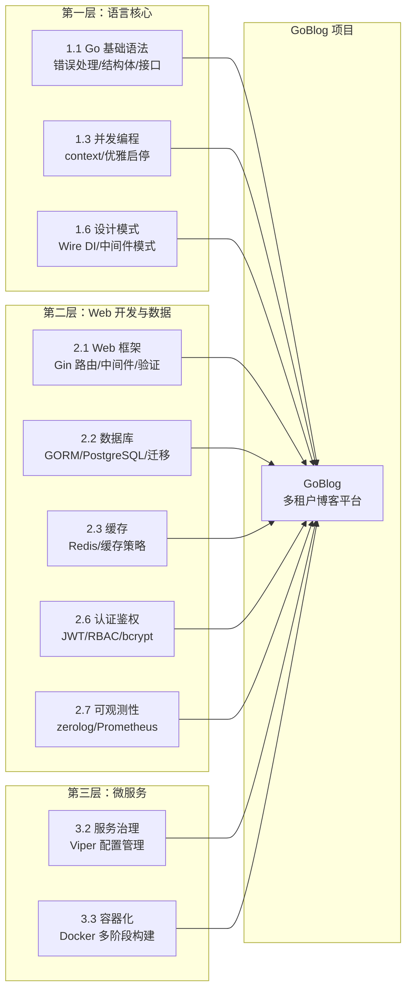

# GoBlog 全栈实战项目

## 项目概述

GoBlog 是一个**多租户博客平台 REST API 后端服务**，作为知识库的"毕业设计"级别实战项目。项目串联知识库第一层（语言核心）和第二层（Web 开发与数据）的核心知识点，让学习者在真实业务场景中综合运用所学技能。

**项目特色：**

- 🏗️ **标准项目布局**：cmd/internal/pkg/configs/migrations 分层清晰
- 🔐 **完整认证鉴权**：JWT 双令牌 + RBAC 三角色权限控制
- 📦 **多层缓存策略**：Redis 文章缓存 + 热门排行榜 + Token 黑名单
- 📝 **结构化日志**：zerolog 请求日志 + 错误日志 + SQL 慢查询日志
- 📊 **Prometheus 监控**：HTTP 请求计数、延迟直方图、活跃连接数
- 🐳 **Docker 一键部署**：多阶段构建，scratch 镜像 ≤ 20MB
- 🔌 **Wire 依赖注入**：编译时依赖注入，类型安全

## 整体架构



## 知识点串联地图

GoBlog 项目串联了知识库中以下模块的核心知识点：



| 技术栈 | 用途 | 对应知识库模块 |
|--------|------|---------------|
| Gin | HTTP 路由与中间件 | [2.1 网络编程与 Web 框架](/2-web-data/2.1-web-framework/) |
| GORM + PostgreSQL | ORM 数据持久化 | [2.2 数据库与 ORM](/2-web-data/2.2-database/) |
| go-redis | 缓存与会话管理 | [2.3 缓存与搜索](/2-web-data/2.3-cache-search/) |
| golang-jwt | JWT 双令牌认证 | [2.6 认证鉴权](/2-web-data/2.6-auth/) |
| RBAC | 角色权限控制 | [2.6 认证鉴权](/2-web-data/2.6-auth/) |
| zerolog | 结构化日志 | [2.7 日志与可观测性](/2-web-data/2.7-observability/) |
| Prometheus | 指标监控 | [2.7 日志与可观测性](/2-web-data/2.7-observability/) |
| Wire | 编译时依赖注入 | [1.6 设计模式与工程化](/1-go-core/1.6-patterns/) |
| golang-migrate | 数据库迁移 | [2.2 数据库与 ORM](/2-web-data/2.2-database/) |
| Viper | 配置管理 | [3.2 服务治理](/3-microservice/3.2-service-governance/) |
| Docker | 容器化部署 | [3.3 容器化与 K8s](/3-microservice/3.3-docker-k8s/) |
| Makefile | 构建自动化 | [1.6 设计模式与工程化](/1-go-core/1.6-patterns/) |

## 项目目录结构

```
goblog/
├── cmd/goblog/main.go          # 程序入口（优雅启停）
├── configs/config.yaml         # Viper 配置文件
├── Dockerfile                  # 多阶段构建
├── docker-compose.yml          # 一键启动
├── Makefile                    # 构建自动化
├── internal/                   # 私有应用代码
│   ├── auth/                   # JWT + bcrypt + RBAC
│   ├── cache/                  # Redis 缓存层
│   ├── config/                 # Viper 配置加载
│   ├── database/               # GORM 数据库连接
│   ├── errcode/                # 业务错误码
│   ├── handler/                # HTTP Handler 层
│   ├── middleware/             # Gin 中间件链
│   ├── model/                  # GORM 数据模型
│   ├── repository/             # 数据访问层
│   ├── router/                 # 路由注册
│   ├── service/                # 业务逻辑层
│   └── wire/                   # 依赖注入
├── pkg/                        # 公共包
│   ├── pagination/             # 分页工具
│   └── response/               # 统一响应格式
├── migrations/                 # 数据库迁移文件
└── scripts/seed.go             # 种子数据脚本
```

## 快速开始

```bash
# 1. 启动依赖中间件
cd code-examples/06-fullstack-project/goblog
docker compose up -d postgres redis

# 2. 执行数据库迁移
make migrate-up

# 3. 初始化种子数据
go run scripts/seed.go

# 4. 启动服务
make run

# 5. 测试 API
curl http://localhost:8080/healthz
```

## 分步实现指南

建议按以下顺序学习和实现：

1. [技术选型说明](./01-tech-stack.md)
2. [项目初始化与环境搭建](./02-project-setup.md)
3. [用户模块实现](./03-user-module.md)
4. [文章模块实现](./04-article-module.md)
5. [标签与评论模块](./05-tag-comment-module.md)
6. [中间件链实现](./06-middleware.md)
7. [缓存策略实现](./07-cache-strategy.md)
8. [测试策略与实现](./08-testing.md)
9. [Docker 部署](./09-deployment.md)

## 参考资料

- [Gin 官方文档](https://gin-gonic.com/docs/)
- [GORM 官方文档](https://gorm.io/docs/)
- [go-redis 文档](https://redis.uptrace.dev/)
- [golang-jwt 文档](https://golang-jwt.github.io/jwt/)
