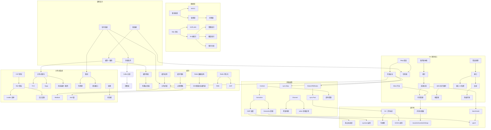
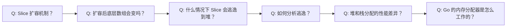
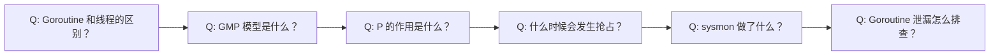
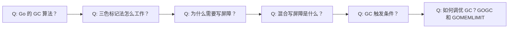

# Go 面试知识图谱

## 知识图谱总览

以下 Mermaid 图展示了 Go 面试中各知识点之间的关联关系和常见追问路径。面试官通常会沿着箭头方向进行追问。

## 面试追问路径详解

### 路径 1：Slice → 内存管理 → 逃逸分析

**考察深度**：初级 → 中级 → 高级

| 追问层级 | 问题 | 难度 | 关联模块 |
|---------|------|------|---------|
| L1 | Slice 扩容策略是什么？ | ⭐ | [数组与切片](/1-go-core/1.1-go-basics/09-slice) |
| L2 | append 后原 slice 和新 slice 共享底层数组吗？ | ⭐⭐ | [数组与切片](/1-go-core/1.1-go-basics/09-slice) |
| L3 | 什么情况下 slice 会逃逸到堆上？ | ⭐⭐ | [逃逸分析](/1-go-core/1.4-runtime/09-escape) |
| L4 | Go 的内存分配器 mcache/mcentral/mheap 是怎么协作的？ | ⭐⭐⭐ | [内存管理](/1-go-core/1.4-runtime/03-memory) |

### 路径 2：Goroutine → GMP → 调度策略

| 追问层级 | 问题 | 难度 | 关联模块 |
|---------|------|------|---------|
| L1 | Goroutine 和 OS 线程有什么区别？ | ⭐ | [goroutine](/1-go-core/1.3-concurrent/01-goroutine) |
| L2 | 解释 GMP 调度模型 | ⭐⭐ | [GMP 调度模型](/1-go-core/1.4-runtime/01-gmp) |
| L3 | Go 1.14 之后的抢占式调度是怎么实现的？ | ⭐⭐⭐ | [GMP 调度模型](/1-go-core/1.4-runtime/01-gmp) |
| L4 | 如何检测和排查 Goroutine 泄漏？ | ⭐⭐ | [goroutine](/1-go-core/1.3-concurrent/01-goroutine) |

### 路径 3：GC → 写屏障 → 性能调优

| 追问层级 | 问题 | 难度 | 关联模块 |
|---------|------|------|---------|
| L1 | Go 用的什么 GC 算法？ | ⭐ | [垃圾回收](/1-go-core/1.4-runtime/02-gc) |
| L2 | 三色标记法的三种颜色分别代表什么？ | ⭐⭐ | [垃圾回收](/1-go-core/1.4-runtime/02-gc) |
| L3 | 写屏障解决了什么问题？ | ⭐⭐⭐ | [垃圾回收](/1-go-core/1.4-runtime/02-gc) |
| L4 | GOGC 和 GOMEMLIMIT 怎么配合调优？ | ⭐⭐⭐ | [垃圾回收](/1-go-core/1.4-runtime/02-gc) |

### 路径 4：Redis 缓存 → 分布式锁 → 一致性

| 追问层级 | 问题 | 难度 | 关联模块 |
|---------|------|------|---------|
| L1 | 缓存穿透、击穿、雪崩的区别？ | ⭐ | [缓存问题](/2-web-data/2.3-cache-search/05-redis-cache-problems) |
| L2 | 如何用 Redis 实现分布式锁？ | ⭐⭐ | [分布式锁](/2-web-data/2.3-cache-search/06-redis-distributed-lock) |
| L3 | Redlock 算法的原理和争议？ | ⭐⭐⭐ | [分布式锁](/4-distributed/4.1-distributed/03-distributed-lock) |
| L4 | 缓存和数据库双写一致性怎么保证？ | ⭐⭐⭐ | [缓存一致性](/4-distributed/4.2-architecture/04-cache-consistency) |

### 路径 5：MySQL 索引 → 事务 → 锁

| 追问层级 | 问题 | 难度 | 关联模块 |
|---------|------|------|---------|
| L1 | MySQL 索引用什么数据结构？ | ⭐ | [MySQL 索引原理](/2-web-data/2.2-database/05-mysql-index) |
| L2 | 聚簇索引和非聚簇索引的区别？ | ⭐⭐ | [MySQL 索引原理](/2-web-data/2.2-database/05-mysql-index) |
| L3 | MVCC 是怎么实现的？ | ⭐⭐⭐ | [MySQL 事务](/2-web-data/2.2-database/06-mysql-transaction) |
| L4 | 间隙锁和临键锁的区别？ | ⭐⭐⭐ | [MySQL 锁机制](/2-web-data/2.2-database/07-mysql-lock) |

## 知识点难度分布

### 初级（⭐）— 校招/初级岗位必考

| 知识点 | 面试频率 | 关联模块 |
|--------|---------|---------|
| Slice 扩容策略 | 🔥🔥🔥 | [数组与切片](/1-go-core/1.1-go-basics/09-slice) |
| defer 执行顺序 | 🔥🔥🔥 | [函数](/1-go-core/1.1-go-basics/06-functions) |
| 值传递 vs 引用传递 | 🔥🔥🔥 | [指针](/1-go-core/1.1-go-basics/11-pointer) |
| Goroutine 和线程的区别 | 🔥🔥🔥 | [goroutine](/1-go-core/1.3-concurrent/01-goroutine) |
| Channel 的基本用法 | 🔥🔥 | [channel](/1-go-core/1.3-concurrent/02-channel) |
| error 接口和错误处理 | 🔥🔥 | [错误处理](/1-go-core/1.1-go-basics/07-error-handling) |
| Map 的基本特性 | 🔥🔥 | [Map](/1-go-core/1.1-go-basics/10-map) |

### 中级（⭐⭐）— 中级岗位/大厂初面

| 知识点 | 面试频率 | 关联模块 |
|--------|---------|---------|
| GMP 调度模型 | 🔥🔥🔥 | [GMP 调度模型](/1-go-core/1.4-runtime/01-gmp) |
| GC 三色标记法 | 🔥🔥🔥 | [垃圾回收](/1-go-core/1.4-runtime/02-gc) |
| 接口 nil 判断陷阱 | 🔥🔥🔥 | [接口](/1-go-core/1.2-go-advanced/01-interfaces) |
| Goroutine 泄漏排查 | 🔥🔥🔥 | [goroutine](/1-go-core/1.3-concurrent/01-goroutine) |
| B+树索引原理 | 🔥🔥🔥 | [MySQL 索引原理](/2-web-data/2.2-database/05-mysql-index) |
| 缓存穿透/击穿/雪崩 | 🔥🔥🔥 | [缓存问题](/2-web-data/2.3-cache-search/05-redis-cache-problems) |
| 分布式锁实现 | 🔥🔥🔥 | [分布式锁](/4-distributed/4.1-distributed/03-distributed-lock) |
| Context 使用和传播 | 🔥🔥 | [context 包](/1-go-core/1.3-concurrent/04-context) |
| 事务隔离级别和 MVCC | 🔥🔥 | [MySQL 事务](/2-web-data/2.2-database/06-mysql-transaction) |

### 高级（⭐⭐⭐）— 高级岗位/大厂深面

| 知识点 | 面试频率 | 关联模块 |
|--------|---------|---------|
| 内存分配器原理 | 🔥🔥 | [内存管理](/1-go-core/1.4-runtime/03-memory) |
| 写屏障和混合写屏障 | 🔥🔥 | [垃圾回收](/1-go-core/1.4-runtime/02-gc) |
| Raft 一致性算法 | 🔥🔥 | [Raft](/4-distributed/4.1-distributed/02-raft) |
| 分布式事务方案对比 | 🔥🔥 | [分布式事务](/4-distributed/4.1-distributed/04-distributed-transaction) |
| 秒杀系统设计 | 🔥🔥 | [秒杀系统](/4-distributed/4.2-architecture/01-seckill) |
| 缓存一致性方案 | 🔥🔥 | [缓存一致性](/4-distributed/4.2-architecture/04-cache-consistency) |
| 逃逸分析和性能调优 | 🔥 | [逃逸分析](/1-go-core/1.4-runtime/09-escape) |
| 抢占式调度实现 | 🔥 | [GMP 调度模型](/1-go-core/1.4-runtime/01-gmp) |
