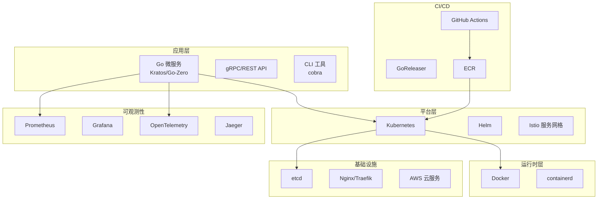

# 云原生工程师路径

## 适合人群

- 想从后端开发转向云原生/DevOps/SRE 方向的 Go 开发者
- 已有 Kubernetes 使用经验，想深入理解底层原理的运维工程师
- 完成 [Go 中级进阶路径](/learning-paths/intermediate) 的学习者
- 目标岗位为云原生工程师、平台工程师、SRE 的求职者

## 预计时间

**6～8 周**（每天 2～3 小时）

## 前置条件

- 熟练掌握 Go 基础语法和并发编程
- 了解 Docker 基本概念和常用命令
- 有 Linux 基础操作能力
- 了解 HTTP/gRPC 等网络协议

## 为什么选择 Go 做云原生

Go 是云原生领域的第一语言。Docker、Kubernetes、etcd、Prometheus、Terraform、Istio、Helm 等核心项目均用 Go 编写。学习 Go 云原生技术栈，不仅能使用这些工具，还能阅读源码、贡献社区、开发 Operator 和 CLI 工具。

## 学习步骤

### 第一阶段：容器化基础（第 1～2 周）

> 目标：掌握 Docker 和 Go 应用容器化的最佳实践

| 步骤 | 知识点 | 文档链接 | 代码示例 | 建议时间 |
|------|--------|---------|---------|---------|
| 1 | Docker 核心概念 | [Docker 核心概念](/3-microservice/3.3-docker-k8s/01-docker-basics) | — | 3h |
| 2 | Go 应用 Dockerfile | [Go 应用 Dockerfile](/3-microservice/3.3-docker-k8s/02-dockerfile) | `03-microservice/docker-k8s/` | 3h |
| 3 | Docker Compose | [Docker Compose](/3-microservice/3.3-docker-k8s/03-docker-compose) | — | 2h |
| 4 | Docker 网络与数据卷 | [Docker 网络与数据卷](/3-microservice/3.3-docker-k8s/04-docker-network) | — | 2h |
| 5 | Linux 常用命令 | [常用命令](/5-devops/5.2-linux/01-commands) | — | 3h |
| 6 | Shell 脚本基础 | [Shell 脚本](/5-devops/5.2-linux/02-shell) | — | 2h |

**🏁 里程碑检查点 1：**
- [ ] 能编写多阶段构建 Dockerfile，Go 镜像大小控制在 10MB 级别
- [ ] 能使用 Docker Compose 编排多服务应用
- [ ] 熟悉 Linux 常用命令和 Shell 脚本基础

### 第二阶段：Kubernetes 核心（第 3～4 周）

> 目标：掌握 K8s 核心概念和 Go 应用部署

| 步骤 | 知识点 | 文档链接 | 代码示例 | 建议时间 |
|------|--------|---------|---------|---------|
| 7 | K8s 架构 | [K8s 架构](/3-microservice/3.3-docker-k8s/05-k8s-architecture) | — | 3h |
| 8 | K8s 核心资源 | [K8s 核心资源](/3-microservice/3.3-docker-k8s/06-k8s-resources) | — | 4h |
| 9 | Go 应用 K8s 部署 | [Go 应用 K8s 部署](/3-microservice/3.3-docker-k8s/07-k8s-go-deploy) | — | 4h |
| 10 | HPA 自动扩缩容 | [HPA](/3-microservice/3.3-docker-k8s/08-k8s-hpa) | — | 2h |
| 11 | Helm 包管理 | [Helm](/3-microservice/3.3-docker-k8s/09-helm) | — | 3h |
| 12 | 命令速查表 | [命令速查表](/3-microservice/3.3-docker-k8s/10-cheatsheet) | — | 1h |

**🏁 里程碑检查点 2：**
- [ ] 能解释 K8s 的 Master/Node 架构和核心组件
- [ ] 能编写 Deployment/Service/ConfigMap/Ingress YAML
- [ ] 能实现 Go 服务的优雅停机（signal.NotifyContext）和健康检查
- [ ] 能使用 Helm 管理 Go 应用的部署

### 第三阶段：服务治理与微服务（第 5～6 周）

> 目标：掌握 Go 微服务的服务发现、配置管理和可观测性

| 步骤 | 知识点 | 文档链接 | 代码示例 | 建议时间 |
|------|--------|---------|---------|---------|
| 13 | etcd 服务发现 | [etcd](/3-microservice/3.2-service-governance/01-etcd) | `03-microservice/service-governance/etcd/` | 3h |
| 14 | Consul | [Consul](/3-microservice/3.2-service-governance/02-consul) | `03-microservice/service-governance/consul/` | 2h |
| 15 | Viper 配置管理 | [Viper](/3-microservice/3.2-service-governance/04-viper) | `03-microservice/service-governance/viper-config/` | 2h |
| 16 | Kratos 微服务 | [Kratos](/3-microservice/3.1-microservice/01-kratos) | `03-microservice/microservice/kratos-example/` | 4h |
| 17 | gRPC | [gRPC](/2-web-data/2.1-web-framework/04-grpc) | `02-web-data/web-framework/grpc-examples/` | 3h |
| 18 | Prometheus 监控 | [Prometheus](/2-web-data/2.7-observability/08-prometheus) | `02-web-data/observability/prometheus/` | 3h |
| 19 | OpenTelemetry | [OpenTelemetry](/2-web-data/2.7-observability/07-otel) | `02-web-data/observability/otel-tracing/` | 3h |
| 20 | Grafana 看板 | [Grafana](/2-web-data/2.7-observability/09-grafana) | — | 2h |

**🏁 里程碑检查点 3：**
- [ ] 能使用 etcd 实现服务注册与发现
- [ ] 能搭建 Prometheus + Grafana 监控 Go 服务
- [ ] 能使用 OpenTelemetry 实现分布式链路追踪
- [ ] 理解 Kratos 框架的分层架构和 Wire 依赖注入

### 第四阶段：CI/CD 与云服务（第 7～8 周）

> 目标：掌握 Go 项目的 CI/CD 流水线和 AWS 云服务集成

| 步骤 | 知识点 | 文档链接 | 代码示例 | 建议时间 |
|------|--------|---------|---------|---------|
| 21 | GitHub Actions | [GitHub Actions](/5-devops/5.1-cicd/01-github-actions) | `05-devops/cicd/` | 3h |
| 22 | GoReleaser | [GoReleaser](/5-devops/5.1-cicd/02-goreleaser) | — | 2h |
| 23 | Makefile | [Makefile](/5-devops/5.1-cicd/03-makefile) | — | 2h |
| 24 | AWS SDK 基础 | [AWS SDK 基础](/3-microservice/3.4-aws/01-sdk-basics) | — | 2h |
| 25 | S3 对象存储 | [S3](/3-microservice/3.4-aws/04-s3) | `03-microservice/aws/s3/` | 3h |
| 26 | SQS 消息队列 | [SQS](/3-microservice/3.4-aws/05-sqs) | `03-microservice/aws/sqs/` | 2h |
| 27 | ECR 镜像仓库 | [ECR](/3-microservice/3.4-aws/06-ecr) | — | 2h |
| 28 | STS 临时凭证 | [STS](/3-microservice/3.4-aws/07-sts) | `03-microservice/aws/sts/` | 2h |
| 29 | Nginx 反向代理 | [反向代理配置](/5-devops/5.3-nginx/02-reverse-proxy) | — | 2h |
| 30 | 负载均衡 | [负载均衡](/5-devops/5.3-nginx/03-load-balancing) | — | 2h |

**🏁 里程碑检查点 4（云原生路径完成）：**
- [ ] 能配置完整的 CI/CD 流水线（lint → test → build → push → deploy）
- [ ] 能使用 AWS S3/SQS/ECR/STS 等核心服务
- [ ] 能配置 Nginx 反向代理和负载均衡
- [ ] 具备独立搭建和运维 Go 云原生服务的能力

## 云原生技术栈全景图

## 下一步

完成云原生路径后，建议：
- 阅读 Kubernetes 源码中的核心组件（kube-scheduler、kube-controller-manager）
- 尝试开发一个 Kubernetes Operator
- 学习 Terraform 进行基础设施即代码管理
- 关注 [Go 高级深入路径](/learning-paths/advanced) 中的分布式系统部分
