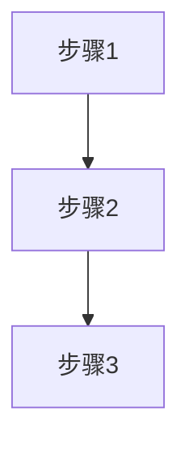

# [知识点标题]

## 概念说明

[用通俗易懂的语言解释这个知识点是什么、解决什么问题。]

## 核心原理

[深入分析底层原理，配合图表说明。]

<!-- 复杂流程必须包含 Mermaid 图 -->



## 标准库方案

[优先展示 Go 标准库的实现方式，体现 Go "Less is More" 哲学。]

```go
// 标准库示例代码
package main

import "fmt"

func main() {
    fmt.Println("标准库方案示例")
}
```

## 第三方库方案

[如有更成熟的第三方方案，在此介绍。说明与标准库方案的对比和选型建议。]

## 代码示例

> 💻 完整可运行代码：[code-examples/模块名/路径](链接)
> 🏷️ Demo 模式：Part A（直接运行）/ Part B（需 Docker）

## 常见面试题

### Q1: [面试题目]

**难度**：⭐⭐⭐ | **频率**：🔥🔥🔥

**答题思路**：

1. [第一步]
2. [第二步]
3. [第三步]

**标准答案**：

[完整答案]

**深入追问**：

- [追问1]
- [追问2]

## 常见陷阱

1. **[陷阱名称]**：[描述 Go 开发者容易犯的错误及正确做法]

## 参考资料

- [Go 官方文档](https://go.dev/doc/)
- [资料名称](链接)
